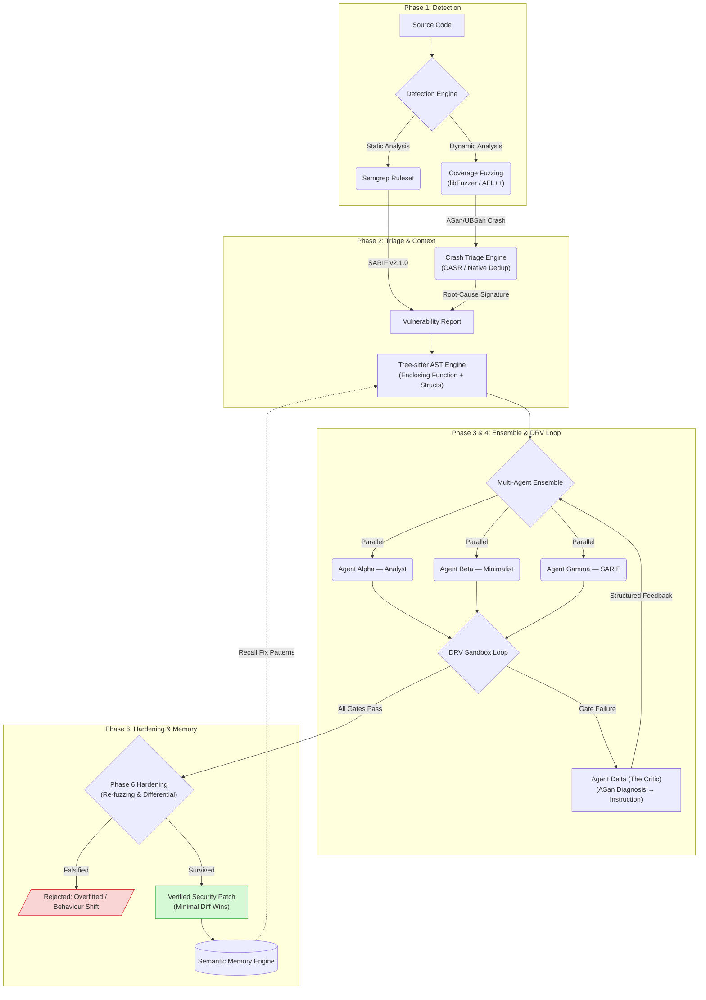
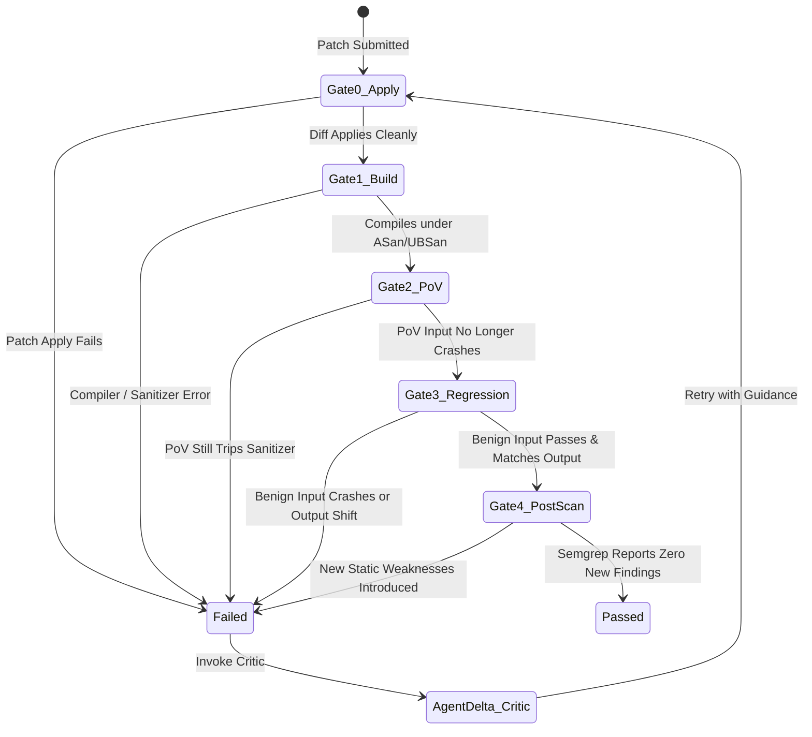

# 🛡️ AI Kavach: Autonomous Cyber Reasoning System (CRS)
## Technical Architecture & Systems Engineering Design Document

**Target Event:** Indian Army Terrier Cyber Quest 2026  
**System Class:** Autonomous Cyber Reasoning System (CRS) for C/C++ Vulnerability Remediation  
**Design Reference:** Inspired by DARPA AIxCC (Artificial Intelligence Cyber Challenge) Architecture  
**Implementation Date:** August 2026  
**Evaluation Reference:** [`benchmark.md`](file:///Users/piyush/Desktop/cyber%20hackathon/ai_kavach_crs/benchmark.md)

---

## 1. Executive Summary

**AI Kavach** is an autonomous, production-grade Cyber Reasoning System (CRS) engineered to detect, triage, patch, and verify memory-safety and complex logic vulnerabilities in C/C++ software without human intervention. 

Traditional automated repair tools fail in real-world C/C++ software for three fundamental reasons:
1. **Context Blindness:** Standard Large Language Models (LLMs) evaluate code snippets in isolation, lacking visibility into deeply nested `typedef` chains, packed bitfields, and header-level `struct` definitions.
2. **Hallucination & Rubber-Stamping:** Standard AI tools generate patches that fail to compile or silently disable security checks without verifying that the underlying crash is resolved.
3. **Overfitting & Functionality Gutting:** Simple LLM patches frequently overfit to the exact crashing input (`if (input == 4) return;`) or gut legitimate functionality via early returns.

AI Kavach solves these challenges through a closed-loop **Observe-Orient-Decide-Act (OODA)** architecture powered by:
- **Tree-sitter AST Context Extraction:** Structurally resolving custom types and header dependencies.
- **Parallel Multi-Agent Ensemble with Critic Feedback:** Specialized patching agents (Alpha, Beta, Gamma) dispatched concurrently, paired with an LLM-as-judge Critic (Agent Delta).
- **Detect-Repair-Verify (DRV) Sandbox Loop:** Enforcing physical compiler (`clang` under ASan/UBSan) and Proof-of-Vulnerability (PoV) replay gates.
- **Phase 6 Patch Hardening:** Falsifying candidate patches via adversarial re-fuzzing and differential execution testing.
- **4-Tier Cross-Run Memory Engine:** Learning ground-truth verified fix patterns across CWE categories.

---

## 2. High-Level System Architecture

The AI Kavach pipeline operates as a deterministic, multi-stage pipeline designed around empirical ground-truth validation:



---

## 3. Deep-Dive Pipeline Phases

### Phase 1: Dual-Path Detection Engine (Static & Dynamic Analysis)

AI Kavach unifies static vulnerability scanning with coverage-guided dynamic fuzzing:

1. **Static Analysis Engine (Semgrep):**
   - Executes pre-configured, high-precision security rulesets (`p/security-audit`, Trail of Bits rules).
   - Generates standardized SARIF v2.1.0 reports detailing vulnerable source lines, CWE mappings, and call-site context.
   
2. **Coverage-Guided Dynamic Fuzzing (libFuzzer & AFL++):**
   - Targets are instrumented with AddressSanitizer (ASan) and UndefinedBehaviorSanitizer (UBSan) using fatal flags: `-fsanitize=address,undefined -fno-sanitize-recover=all`.
   - Uses a unified C harness entrypoint (`LLVMFuzzerTestOneInput`). For AFL++, an automated adapter (`afl_driver.c`) bridges file-based `@@` inputs to the in-memory fuzzer harness.
   - Automatically configures macOS shared-memory parameters (`AFL_MAP_SIZE=65536`) and detects Homebrew LLVM toolchains where Apple `clang` lacks native fuzzer runtimes.

---

### Phase 2: Crash Triage & Tree-sitter AST Context Engine

1. **Crash Triage & Deduplication Engine:**
   - Replays crashing inputs against instrumented binaries and captures raw stderr sanitizer reports.
   - Extracts crash class (e.g., `heap-buffer-overflow`, `heap-use-after-free`, `global-buffer-overflow`) and normalizes stack frames, stripping out sanitizer interceptors, libc routines, and fuzzer scaffolding.
   - Clusters thousands of raw fuzzer crashes into a single canonical report per root cause, mapping crash signatures directly to CWE IDs (e.g., `heap-use-after-free` $\rightarrow$ CWE-416). Uses `casr-san` when available, falling back to a native sanitizer triage parser.

2. **Tree-sitter AST Context Engine:**
   - Standard LLMs fail when patching C code because they do not see type definitions.
   - The Context Engine parses the complete C/C++ Abstract Syntax Tree (AST), identifies the vulnerable function node, and recursively walks up the AST to extract:
     - Enclosing function boundaries and local variable declarations.
     - Struct, union, and enum definitions referenced by function parameters or local variables.
     - Chained `typedef` definitions and packed bitfield layouts defined across header files.
   - Injects the complete structural context into the LLM prompt, enabling type-accurate patch synthesis.

---

### Phase 3: Multi-Agent Ensemble & Agent Delta (The Critic)

AI Kavach deploys a parallel **multi-agent ensemble** operating under a specialized division of labor. Agents are dispatched with `concurrent.futures.ThreadPoolExecutor`; **LangGraph is not used** by the current implementation and is commented out of `requirements.txt`.

```
                          ┌───────────────────────────┐
                          │   Vulnerability Context   │
                          └─────────────┬─────────────┘
                                        │
                ┌───────────────────────┼───────────────────────┐
                ▼                       ▼                       ▼
      Agent Alpha (Analyst)   Agent Beta (Minimalist)  Agent Gamma (SARIF)
      - Chain-of-Thought      - Surgical 1-line diffs  - Static remediation
      - Complex state logic   - Bounds / null checks   - Deprecated API swap
                └───────────────────────┼───────────────────────┘
                                        │
                                        ▼
                            DRV Verification Sandbox
                                        │
                                [Gate Failure]
                                        │
                                        ▼
                            Agent Delta (The Critic)
                            - LLM-as-Judge (JSON Schema)
                            - Diagnoses ASan dump
                            - Emits 1 actionable directive
```

1. **Agent Alpha (The Analyst):** Employs Chain-of-Thought (CoT) reasoning to explain *why* the memory flaw occurs before generating code. Specialized for multi-variable state bugs, integer truncation, and underflows.
2. **Agent Beta (The Minimalist):** Constrained to produce the smallest valid AST modification (e.g., single bounds check or null check). Specialized for OOB reads/writes and memory leaks.
3. **Agent Gamma (The SARIF Patcher):** Specialized in handling static analysis findings (e.g., replacing `strcpy` with `snprintf`, fixing format string specifiers).
4. **Agent Delta (The Critic - LLM-as-Judge):**
   - Invoked *only* when a patch fails a DRV gate.
   - Does **not** write code. Instead, it parses the raw AddressSanitizer stack trace, compiler error, or failing PoV output and outputs a structured JSON verdict:
     ```json
     {
       "verdict": "insufficient_fix",
       "root_cause": "Bounding the write removed the NUL terminator, causing printf to over-read.",
       "what_the_patch_missed": "The buffer size check passed, but dest[size] was not NUL-terminated.",
       "actionable_instruction": "Add dest[size-1] = '\\0'; immediately after the bounded copy."
     }
     ```
   - Resolves LLM oscillation loops by transforming verbose ASan dumps into single, high-precision repair instructions.

#### Dual Patch Format Support
Agents support two patch delivery mechanisms:
- **Unified Diff Format (`patch.diff`):** Traditional line-based patch diffs.
- **Whole-Function AST Splicing (`// FUNCTION: <name>`):** Splicing the complete corrected function directly into the AST range. Eliminates wasted iterations caused by whitespace or line-drift diff application failures.

---

### Phase 4: Detect-Repair-Verify (DRV) Sandbox Loop

Every generated patch undergoes physical sandbox testing in an isolated workspace. A patch is validated **only** if it passes all 5 physical gates:



| Gate | Check Name | Verification Action | Fail Condition |
| :---: | :--- | :--- | :--- |
| **Gate 0** | **Apply** | Dry-run patch application against pristine copy | Hunk context mismatch or ambiguous placement |
| **Gate 1** | **Build** | Compile under `clang` with ASan + UBSan (`-fno-sanitize-recover=all`) | Compiler error or sanitizer warning during compilation |
| **Gate 2** | **PoV Replay** | Replay original crashing input against **rebuilt patched binary** | Sanitizer signal (SIGSEGV, ASan report, non-zero return) |
| **Gate 3** | **Regression** | Execute benign reference inputs | Crash, non-zero exit code, or stdout deviation |
| **Gate 4** | **Post-Scan** | Re-run Semgrep static analyzer | Presence of newly introduced security findings |

#### Deterministic Escalation Policy
Repair loop control is governed by an un-hallucinable Python state machine (`EscalationPolicy`):
- If PoV replay fails $\rightarrow$ Immediately invoke Agent Delta (The Critic).
- If Gate 0 (Apply) fails twice $\rightarrow$ Force agents to switch to Whole-Function AST Splicing.
- If any single stage fails 4 times $\rightarrow$ Terminate agent loop early to conserve budget.

---

### Phase 5: Self-Gated Concolic Execution Engine (Driller)

Coverage-guided fuzzers frequently stall on hard magic-value comparisons (e.g., `if (header->magic == 0x4b415641)` has a 1-in-4-billion chance of random discovery).

1. **Plateau Monitor:** Monitors AFL++ `fuzzer_stats` or libFuzzer coverage logs to detect coverage plateaus (no new paths across N execution cycles).
2. **angr Symbolic Solver:** Symbolically executes the binary up to the stalled branch, uses SMT solving (Z3) to calculate the exact byte sequence required to satisfy the condition, and injects the solved input back into the fuzzer queue.
3. **Automated Self-Testing Gate (`DrillerEngine.self_test()`):**
   - Symbolically executing binaries across different CPU architectures can produce false solutions.
   - At startup, Driller runs a known-answer test binary requiring input `"KAVA"`.
   - If the solver fails to recover `"KAVA"` (e.g., due to `angr` limitations on arm64 Mach-O binaries), Driller **automatically disables itself** and logs a clear platform reason, ensuring no invalid solved inputs are ever fed to the pipeline.

---

### Phase 6: Adversarial Patch Hardening & Falsification Engine

Passing the 5 DRV gates proves an input no longer crashes, but does not prove the fix is correct. Phase 6 actively attempts to **falsify** validated patches before final acceptance:

1. **PoV Overfitting Defense (Adversarial Re-Fuzzing):**
   - Re-fuzzes the *patched binary* for 20 seconds, seeded with the original crashing input.
   - If the fuzzer discovers a new crash, the patch is rejected as an input-specific overfit (`if (val == 4) return;`).
   
2. **Functionality Gutting Defense (Differential Execution Testing):**
   - Executes the original and patched binaries side-by-side across 25 generated benign inputs.
   - Compares stdout, stderr, and exit codes. If behavior diverges on inputs where the original did *not* crash, the patch is rejected for gutting functionality.

3. **Behavioral Contracts (`preserve` vs. `restrict`):**
   - **`preserve` (Default):** For memory safety fixes (UAF, Buffer Overflow), program behavior must match the original exactly.
   - **`restrict`:** For input validation fixes (CWE-78 Command Injection, CWE-22 Path Traversal), the security remediation **is** to reject inputs the original accepted. Differential testing is automatically bypassed for `restrict` targets, relying on the regression gate instead to prevent false rejections.

---

## 4. Multi-Tier Cross-Run Memory Engine

AI Kavach incorporates a 4-tier memory architecture (`src/memory/`) to eliminate repetitive LLM work and transfer fix strategies across vulnerabilities:

```
┌────────────────────────────────────────────────────────────────────────┐
│                        AI KAVACH MEMORY ENGINE                         │
├───────────────────┬────────────────────────────────────────────────────┤
│ 1. Working        │ Per-target attempt ledger & Critic verdicts        │
│ 2. Episodic       │ Append-only JSONL execution trajectories           │
│ 3. Semantic       │ Ground-truth verified fix patterns (CWE-indexed)  │
│ 4. Procedural     │ Agent success rates & iteration routing per CWE    │
└───────────────────┴────────────────────────────────────────────────────┘
```

### The Ground-Truth Memory Principle
Standard LLM agent memory suffers from **hallucinated reflection**: storing unverified agent notes as permanent facts. 

AI Kavach avoids this by enforcing **Ground-Truth Learning**:
- A fix pattern is written to Semantic Memory **only after** it compiles under ASan/UBSan, passes PoV replay, passes regression, and survives Phase 6 Hardening.
- **Confidence Decay:** If a recalled semantic pattern is applied to a new target and fails DRV verification, its confidence score decays, preventing stale or bad patterns from persisting.

---

## 5. Technology Stack & System Requirements

| Layer | Technology / Library | Version / Details |
| :--- | :--- | :--- |
| **Language & Runtime** | Python | 3.11.15 |
| **CLI & Interface** | Rich CLI | Terminal formatting, progress tables |
| **LLM Backend** | OpenAI API Client | Thread-safe usage tracking; default `gpt-4o-mini` |
| **AST Parser** | Tree-sitter | `tree-sitter-c`, `tree-sitter-cpp` |
| **Static Analysis** | Semgrep | v1.172.0 (`p/security-audit` ruleset), SARIF v2.1.0 |
| **Dynamic Fuzzing** | libFuzzer & AFL++ | LLVM 22 (`clang`), AFL++ v5.02c |
| **Crash Triage** | Native ASan / CASR | Stack trace normalization, CWE mapping |
| **Concolic Execution** | `angr` & Z3 | SMT constraint solving (Self-gated) |
| **Compilers & Sanitizers** | LLVM `clang` | ASan, UBSan (`-fno-sanitize-recover=all`) |
| **Hardening** | LibFuzzer & Differential | Adversarial re-fuzzing + side-by-side diff execution |
| **Unit Testing** | `pytest` | 71 unit tests, 0 API calls required for unit suite |

---

## 6. Formal Verification Contract & Pre-Flight Rules

To ensure mathematical honesty in all benchmark reporting, AI Kavach operates under 3 strict verification rules:

1. **`SKIPPED` is Never a Pass:** If a target lacks a PoV command or regression command, the gate status is explicitly recorded as `SKIPPED` with a documented reason. It is never counted toward PoV-proven totals.
2. **Mandatory Pre-Flight PoV Validation:** Before any agent runs, the target is compiled *unpatched* and the PoV executed. If the PoV fails to reproduce a crash on the unpatched binary, it is disabled—ensuring a patch can never be credited for fixing something that was not broken.
3. **Determinism Screening:** Differential execution testing runs the original binary twice per input. If the original's output is non-deterministic (e.g., DNS lookups or timestamps), differential comparison is skipped to avoid false regression readings.

---

## 7. Operational Summary

AI Kavach bridges the gap between academic AI research and defense-grade Cyber Reasoning Systems. By combining **Tree-sitter AST structural awareness**, **Parallel Multi-Agent Orchestration with Critic Feedback**, **Physical ASan/UBSan DRV Loop Validation**, **Adversarial Hardening**, and **Ground-Truth Semantic Memory**, AI Kavach delivers autonomous, surgical, and rigorously verified security patches for mission-critical C/C++ infrastructure.
